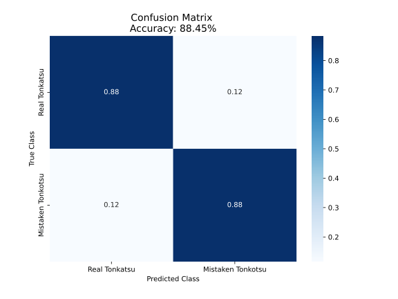

# tonkotsu_cop_bot
A reddit bot for spreading awareness of the misspelling of "tonkotsu".

## The Problem

In some reddit communities, especially [r/ramen](https://www.reddit.com/r/ramen/), there is a recurring theme of users spelling [tonkotsu](https://en.wikipedia.org/wiki/Tonkotsu_ramen) as "tonkatsu". Several users have expressed interest in a bot that comments on such posts, pointing out the mistake. However, a challenge arises because [tonkatsu](https://en.wikipedia.org/wiki/Tonkatsu) is itself another japanese cuisine item. So, not all instances of the word "tonkatsu" are mistakes!

Just for fun, check out some people posting their [Tonkatsu tonkotsu](https://www.reddit.com/r/ramen/comments/c05j6f/tonkatsu_tonkotsu_ramen/)!

## My Solution

I began to think that I could use a simple conditional statement to correctly identify mistake spelling, at least most of the time. For instance, if "tonkatsu" was followed by the word "broth" or "ramen", then it was probably a mistake. If "tonkatsu" was followed by "pork cutlet", it probably was not a mistake.

I quickly realized that this solution lacked elegance, but was on the right track. What I needed was an automated way for a program to learn those patterns (and many more) on its own; *machine learning*.

The simple, yet surprisingly effective algorithm chosen for the task is a naïve Bayes model. I trained the model by finding all the posts I could in [r/ramen](https://www.reddit.com/r/ramen/), [r/food](https://www.reddit.com/r/food/), and [r/FoodPorn](https://www.reddit.com/r/FoodPorn/) that contained the word "tonkatsu", and labelling them as true tonkatsu, or mistaken tonkotsu. The model finds which other words in the title are correlated with which label (correct vs. incorrect spelling). Once trained, the model can be used to assign a predicted label to new titles it's never seen before.

This model is imported into the bot script which signs into reddit and scans several subreddits' new posts. If "tonkatsu" is found, then the model is used to predict if the spelling was a mistake. If it predicts it is, then it comments, if not it moves on. In either case it sends itself, and me, information about the action taken. In this way, I can use this as more training data to improve the model.

As a final consideration, the bot monitors the scores of its previous comments. If they get too many downvotes, the bot deletes the comment. In this way, if the bot mistakenly comments on true *tonkatsu*, the community has a way of easily removing it.

## Scripts Overview

`bayes.py`: Train a multinomial naïve bayes model trained on bag-of-words from submission titles.

`bot.py`: Interact with reddit to get titles, use model created by `bayes.py` to predict if title has typo, comment if so.

`test_bot.py`: Test suite for `bot.py`.

`sched.sh`: Shell script executed by CRON for scheduled running of `bot.py`.

`data/`
* `all_labeled_data.txt`: Labeled training and testing data.
* `comment.txt`: Comment string formatted for markdown.
* `confusion_matrix.svg`: Only used in this README.md.

## `bayes.py`
```
$ ./bayes.py -h
usage: bayes.py [-h] [-d FILE] [-o FILE] [-t FILE] [-s FLOAT]

Generate bayesian model for tonkatsu

optional arguments:
  -h, --help            show this help message and exit
  -d FILE, --data FILE  Labeled data file (default: data/all_labeled_data.txt)
  -o FILE, --out FILE   Name of model output (pickle) (default:
                        data/model.pkl)
  -t FILE, --test_out FILE
                        Test data output file (default: data/test_data.txt)
  -s FLOAT, --test_split FLOAT
                        Test data split ratio (default: 0.2)
 ```

Contents of `data/all_labelled_data.txt` (`--data`) were produced by using Google search in /r/ramen, /r/food, and /r/foodporn to find instances of the word "tonkatsu" in submission titles. A label was assigned manually to indicate if "tonkatsu" was the right spelling (`0`), or if "tonkotsu" is what the user meant (`1`).

These entries are split into training and testing data (`--test_split`). The training data is fed into a scikit-learn `CountVectorizer`, and that fitted `CountVectorizer` is kept for reuse on the test data set.

The vectorized titles are used to train a multinomial naïve bayes model.

Model is used to predict a label of the title containing "tonkatsu" - `1`: mistake spelling, `0`: correct spelling.

Test data are vectorized using the same `CountVectorizer`, the model is tested, and a confusion matrix is produced.

Test data true values, predicted values, and original title strings are stored in a .txt file (`--test_out`) for use in testing.

Finally, a pickle (`--out`) is produced containing the model, the test data (including true labels), prediction accuracy, and the `CountVectorizer`. The inclusion of test data and accuracy allows for performance consistency assessment when the model is imported for use in `bot.py`.



Unfortunately, since the size of data is small (n=120 and counting), model accuracy upon testing can vary run-to-run (of `bayes.py`, not `bot.py`). Assessed accuracy is on average 88% (95% confidence interval on the average is 78% to 90%).

### Expected Behavior
```
$ ./bayes.py
Extracting features
Training model
Testing model
Model accuracy: 87.5%
Assessing confusion matrix
Removing previous test data file.
Saving test data.
Saving pickle
```


## `bot.py`
```
$ ./bot.py -h
usage: bot.py [-h] [-c FILE] [-D] [-d FILE] [-l FILE] [-m PKL] [-p FILE]

Run the Tonkotsu Police Bot

optional arguments:
  -h, --help            show this help message and exit
  -c FILE, --comment FILE
                        Bot comment string file (default: data/comment.txt)
  -D, --Debug           Debugging flag (default: False)
  -d FILE, --deleted FILE
                        Deleted comments file (default: data/deleted.txt)
  -l FILE, --log FILE   Log file (default: data/.log)
  -m PKL, --model PKL   Model for classifying titles (default: data/model.pkl)
  -p FILE, --posts FILE
                        Previously assessed posts file (default:
                        data/id_file.txt)
```

`PRAW` is used to create a reddit instance, signing the bot in using the info of the local `config.py` file.

The bot looks at the newest posts in the subreddits of interest, and hits on those containing the string "tonkatsu" (case insensitive). If the post has not been assessed before (as indicated by the presence of the post ID in `--posts`), then the previously trained model (`--model`) is used to assign a label/prediction to the post title.

If the model predicts mistake spelling, a comment (`--comment`) is posted. If the model predicts non-mistake spelling, no comment is posted. The bot then sends a message to itself and a "human" overseer account describing its choice of action. 

Whether or not the model predicted mistake spelling, the post ID and title string are recorded in `--posts`.

Next, the bot checks its previous comments' statuses. If they have been downvoted too many times, the comment is deleted, and messages are sent. The comment ID is recorded in `--deleted` for later reference.

During the above steps, logging takes place. By default, only `logging.info` is used, but `logging.debug` may be activated with `--debug` for more thorough logging to the `--log` file.

Running of the bot is accomplished with CRON instead of continuously running the script and utilizing `submission.stream()` in PRAW. This is to avoid known issues related to that function's inability to handle exceptions and continue or restart the stream.

### Expected Behavior
```
$ ./bot.py
Logging in... log in successful.
Logged in as TonkotsuOrTonkatsu.
Scanning...

Tonkatsu found in post: go9w3o.
Post title: "I made Pork Tonkatsu with Stir Fried Cabbage and a Warm Golden Beet and Sesame Salad".
Model predicted correct spelling.
Not commenting.

Done scanning.
Commented on 0 posts.

Checking to purge comments...
Done purging.
```


## `test_bot.py`

Test various functionalities of `bot.py`. When things start going wrong, this can help figure out where it is failing. Also good for quickly checking if script changes break previous functionality. Currently testing is sparse.

### Expected Behavior
```
$ python3 -m pytest -v test_bot.py
============================= test session starts =============================
platform linux -- Python 3.7.3, pytest-5.4.2, py-1.8.1, pluggy-0.13.1 -- /home/pi/Documents/reddit_bots/tonkotsu_cop_bot/env/bin/python3
cachedir: .pytest_cache
rootdir: /home/pi/Documents/reddit_bots/tonkotsu_cop_bot
collected 8 items

test_bot.py::test_usage PASSED                                           [ 12%]
test_bot.py::test_bad_input PASSED                                       [ 25%]
test_bot.py::test_get_history PASSED                                     [ 37%]
test_bot.py::test_config PASSED                                          [ 50%]
test_bot.py::test_login PASSED                                           [ 62%]
test_bot.py::test_post_ret PASSED                                        [ 75%]
test_bot.py::test_predict PASSED                                         [ 87%]
test_bot.py::test_runs_defaults PASSED                                   [100%]

============================= 8 passed in 32.75s ==============================
```

## `sched.sh`

Shell script is executed on a schedule due to entry in CRON Table (`crontab -e`)

Since `cron` runs from `home`, shell script `cd`'s into the bot directory. The Python `env`ironment is activated, `bot.py` is executed, and the `env` is deactivated. Accomplishing these multiple commands in a shell script was easier than via cron.
